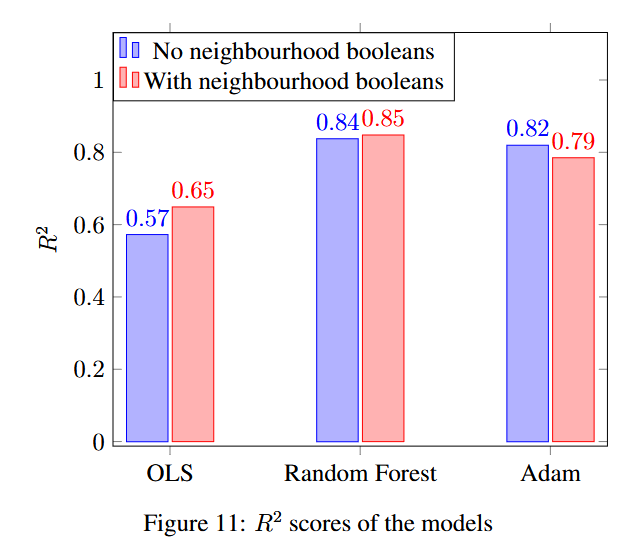

# Rental Price Prediction in Chicago: Comparing OLS, Random Forest, and Neural Networks

This repository contains the code and analysis for my master's thesis: **"A Comparative Study of Econometric Methods for Rental Price Prediction Using Zillow Data"**. The project compares Ordinary Least Squares (OLS), Random Forest (RF), and Neural Network (NN) regressors on a large dataset of Chicago rental listings ($n=5302$).

## Key Findings

- **Random Forest** achieves the best out‑of‑sample performance ($R^2 \approx 0.838$)
- **Neural Network** (Adam solver) follows closely ($R^2 \approx 0.820$)
- **OLS** lags behind ($R^2 \approx 0.573$)
- Neighbourhood characteristics improve OLS markedly (+6.6% $R^2$) but barely affect RF and even hurt NN performance, suggesting diminishing returns from noisy variables for more complex models.

## Methodology

- **Data source**: Zillow rental listings for Chicago (collected via WebScraper.io, cleaned with Python).
- **Preprocessing**: Outlier removal (IQR), missing value imputation (mean, mode, neighbourhood‑based), dummy encoding for categorical variables.
- **Models**:
  - OLS with heteroscedasticity‑robust standard errors (HC3).
  - Random Forest with grid‑searched hyperparameters (n_estimators=1000, max_depth=25, min_samples_split=2).
  - Neural Network (Adam, SGD, LBFGS) with grid search over layers (1‑3), neurons (50‑500), learning rate (0.001‑0.1), and activation (ReLU, tanh).
- **Evaluation**: Out‑of‑sample $R^2$ on a 70/30 train‑test split.

## Results

| Model          | $R^2$ (no neighbourhood) | $R^2$ (with neighbourhood) |
|----------------|--------------------------|----------------------------|
| OLS            | 0.573                    | 0.649                      |
| Random Forest  | 0.838                    | 0.842                      |
| Neural Network | 0.820                    | 0.785                      |

Scatter plots of predicted vs. actual values and feature importance graphs are available in the `images/` folder.

